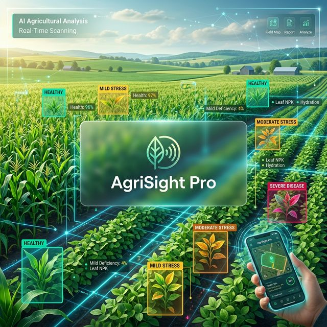

# AgriSight Pro 🌾



## Overview
**AgriSight Pro** is a state-of-the-art AI-powered agricultural monitoring system designed to empower farmers and agronomists with real-time crop health insights. Leveraging advanced computer vision and deep learning, AgriSight detects plant diseases, assesses severity, and provides actionable data to optimize crop yield and reduce losses.

## 🚀 Key Features
- **Live AI Scanning**: Real-time disease detection using YOLOv8 with precision bounding box overlays.
- **Severity Heuristics**: Automatic categorization of crop health into **Mild**, **Moderate**, and **Severe** based on leaf coverage analysis.
- **Smart History Tracking**: A persistent database of all historical scans, including confidence scores and severity grades.
- **Modern Dashboard**: A beautiful, responsive interface featuring glassmorphism aesthetics and intuitive navigation.
- **Cross-Platform Readiness**: Integrated React-based frontend for mobile and web accessibility.

## 🛠 Tech Stack
- **AI/ML**: YOLOv8 (Ultralytics), OpenCV, NumPy
- **Backend**: Python, Streamlit, SQLAlchemy (SQLite)
- **Frontend**: React, Vite, Tailwind CSS
- **Database**: SQLite for local persistence

## 📦 Installation & Setup

### Prerequisites
- Python 3.9+
- Node.js (for frontend development)

### Backend Setup
1. Clone the repository:
   ```bash
   git clone https://github.com/ubturja/AgriSight.git
   cd AgriSight
   ```
2. Install dependencies:
   ```bash
   pip install -r requirements.txt
   ```
3. Run the Streamlit dashboard:
   ```bash
   streamlit run app.py
   ```

### Frontend Setup (Optional)
1. Navigate to the frontend directory:
   ```bash
   cd frontend
   ```
2. Install dependencies:
   ```bash
   npm install
   ```
3. Start the development server:
   ```bash
   npm run dev
   ```

## 📂 Project Structure
```text
AgriSight/
├── ai_pipeline.py    # YOLOv8 inference logic
├── app.py           # Streamlit dashboard & UI
├── models.py        # Database schema (SQLAlchemy)
├── weights/         # Pre-trained YOLOv8 models
├── static/          # Uploaded scan storage
└── frontend/        # React + Vite application
```

## 🛡 License
This project is licensed under the MIT License.

## 🤝 Contributing
Contributions are welcome! Please open an issue or submit a pull request for any improvements or bug fixes.

---
*Built with ❤️ for a more sustainable future in agriculture.*
